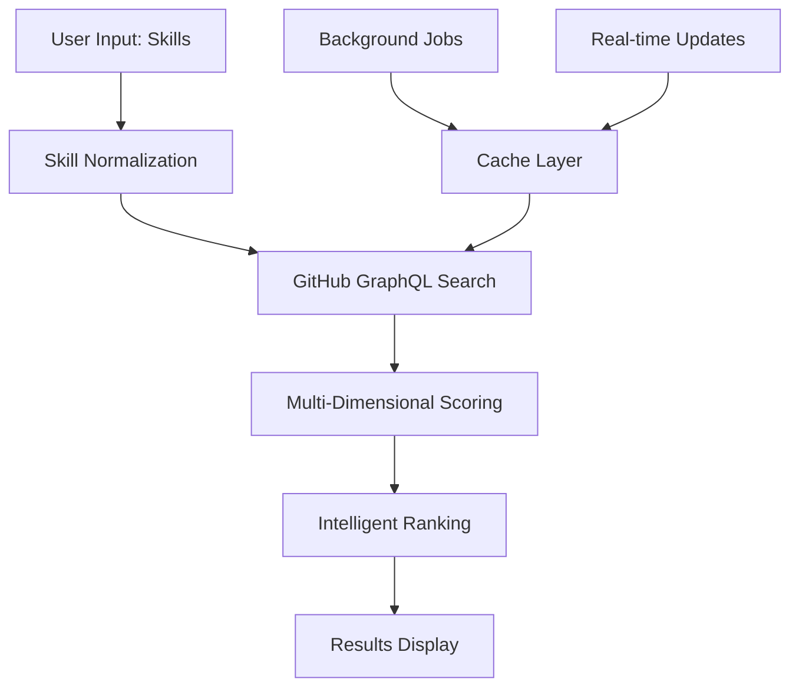

# 🚀 RepoMatch

**Find your next open-source contribution in seconds**

A smart platform that matches developers with GitHub repositories perfect for their skills and contribution goals. No more endless scrolling through repositories – get personalized suggestions powered by intelligent scoring algorithms.


## ✨ Key Features

### 🎯 **Smart Matching Engine**
Input your skills (languages, frameworks, tools) and get repositories ranked by relevance, quality, and contribution opportunities using our advanced scoring algorithm.

### 🔥 **"I'm Feeling Lucky" Mode**
Get instant random suggestions from high-quality repositories matching your skills – perfect for discovering new projects outside your comfort zone.

### 📊 **Multi-Dimensional Scoring**
- **Relevance Score** (50%): Language + topics + README keyword matching
- **Quality Score** (30%): Stars, forks, recent activity, documentation health
- **Opportunity Score** (20%): Open "good first issues", maintainer responsiveness

### 🧠 **Intelligent Skill Expansion**
Our system automatically expands your skills using semantic relationships:
- `react` → `javascript`, `jsx`, `frontend`, `web`, `ui`
- `machine-learning` → `python`, `tensorflow`, `pytorch`, `data-science`

### ⚡ **Lightning Fast Results**
- Multi-layer caching (browser → CDN → API)
- Parallel API processing
- Progressive result loading
- Smart request batching

### 📈 **Advanced Opportunity Detection**
Beyond basic issue labels, we analyze:
- Maintainer response times
- Contribution success rates
- Documentation gaps
- Stale issues needing attention
- Test coverage opportunities

### 🎨 **Dynamic Scoring Modes**
- **Profile Building**: Focus on high-quality, well-known repositories
- **Learning Mode**: Prioritize educational value and skill development
- **Quick Wins**: Target easy contributions for immediate impact

## 🏗️ How It Works



### The Process

1. **Skill Processing**: Your input skills are expanded using our semantic skill graph
2. **Smart Search**: Batched GitHub GraphQL queries fetch repository metadata
3. **Scoring Engine**: Each repo gets scored across relevance, quality, and opportunity dimensions
4. **Intelligent Ranking**: Results are ranked or randomly weighted based on your preference
5. **Fresh Results**: Real-time scoring ensures you always get current opportunities

## 🛠️ Tech Stack

| Category | Technology | Why |
|----------|------------|-----|
| **Frontend** | Next.js + React | Server-side rendering, excellent developer experience |
| **Styling** | Tailwind CSS | Rapid UI development, consistent design system |
| **Backend** | Next.js API Routes | Serverless functions, same codebase as frontend |
| **Database** | Supabase (PostgreSQL) | Real-time capabilities, built-in auth, easy scaling |
| **Caching** | Redis (Upstash) | Fast data retrieval, session management |
| **API** | GitHub GraphQL | Efficient data fetching, rich repository metadata |
| **Deployment** | Vercel | Seamless Next.js deployment, global CDN |
| **Icons** | Lucide React | Consistent, beautiful icons |

## 🚀 Quick Start

### Prerequisites
- Node.js 18+
- GitHub Personal Access Token
- Supabase account
- Upstash Redis account

### Installation

```bash
# Clone the repository
git clone https://github.com/yourusername/github-repo-finder.git
cd github-repo-finder

# Install dependencies
npm install

# Set up environment variables
cp .env.example .env.local
```

### Environment Variables

```bash
# GitHub API
GITHUB_TOKEN=your_github_personal_access_token

# Supabase
NEXT_PUBLIC_SUPABASE_URL=your_supabase_project_url
NEXT_PUBLIC_SUPABASE_ANON_KEY=your_supabase_anon_key
SUPABASE_SERVICE_ROLE_KEY=your_supabase_service_role_key

# Redis
UPSTASH_REDIS_REST_URL=your_upstash_redis_url
UPSTASH_REDIS_REST_TOKEN=your_upstash_redis_token

# App
NEXTAUTH_URL=http://localhost:3000
NEXTAUTH_SECRET=your_nextauth_secret
```

### Run Development Server

```bash
npm run dev
```

Visit `http://localhost:3000` to see your application running.

## 📁 Project Structure

```
├── src/
│   ├── components/          # React components
│   │   ├── ui/             # Reusable UI components
│   │   ├── search/         # Search-related components
│   │   └── results/        # Result display components
│   ├── pages/
│   │   ├── api/            # API routes (serverless functions)
│   │   │   ├── search.js   # Main search endpoint
│   │   │   └── trending.js # Trending repositories
│   │   ├── index.js        # Home page
│   │   └── results.js      # Results page
│   ├── lib/
│   │   ├── github.js       # GitHub API client
│   │   ├── scoring.js      # Repository scoring algorithms
│   │   ├── cache.js        # Caching utilities
│   │   └── skills.js       # Skill normalization
│   └── utils/
│       ├── constants.js    # App constants
│       └── helpers.js      # Utility functions
├── public/                 # Static assets
├── database/
│   └── schema.sql         # Database schema
└── docs/                  # Documentation
```

## 🔧 API Endpoints

### `POST /api/search`
Search for repositories based on skills.

```javascript
// Request
{
  "skills": ["react", "typescript", "tailwind"],
  "mode": "profile-building", // or "learning" or "quick-wins"
  "limit": 20
}

// Response
{
  "repositories": [
    {
      "id": "repo-id",
      "name": "awesome-project",
      "full_name": "user/awesome-project",
      "description": "An awesome React project",
      "url": "https://github.com/user/awesome-project",
      "stars": 1500,
      "language": "TypeScript",
      "topics": ["react", "typescript", "ui"],
      "scores": {
        "relevance": 0.9,
        "quality": 0.8,
        "opportunity": 0.7,
        "final": 0.83
      },
      "opportunities": [
        {
          "type": "good-first-issue",
          "count": 5,
          "url": "https://github.com/user/awesome-project/issues?q=is%3Aopen+label%3A%22good+first+issue%22"
        }
      ]
    }
  ],
  "total": 150,
  "cached": false,
  "search_time_ms": 245
}
```

### `GET /api/trending`
Get trending repositories for quick suggestions.

## 🎨 Features in Detail

### Intelligent Skill Expansion
Our skill normalization engine understands technology relationships:
- **Framework → Language**: `React` includes `JavaScript`
- **Ecosystem awareness**: `Django` suggests `Python`, `REST API`, `PostgreSQL`
- **Version-aware**: `Vue 3` includes `Composition API`, `TypeScript support`

### Advanced Opportunity Detection
We go beyond simple issue labels to find real contribution opportunities:
- **Maintenance opportunities**: Outdated dependencies, broken CI/CD
- **Documentation gaps**: Missing examples, outdated guides
- **Code quality**: Areas needing refactoring, test coverage
- **Community engagement**: Unanswered questions, feature requests

### Smart Caching Strategy
Multi-layer caching ensures blazing fast responses:
- **Browser cache** (1 hour): User preferences, recent searches
- **CDN cache** (6 hours): Popular skill combinations
- **Redis cache** (24 hours): Repository metadata
- **Background refresh**: Proactive cache warming for trending skills

## 🚦 Performance Optimizations

- **Request coalescing**: Batch similar user requests
- **Parallel processing**: Score repositories concurrently
- **Progressive loading**: Show results as they're calculated
- **Smart prefetching**: Preload likely next searches
- **Edge caching**: Global CDN for instant responses

## 🤝 Contributing

We love contributions! Please read our [Contributing Guide](CONTRIBUTING.md) for details on:
- Code of conduct
- Development workflow
- Commit message format
- Pull request process

### Development Commands

```bash
npm run dev          # Start development server
npm run build        # Build for production
npm run start        # Start production server
npm run lint         # Run ESLint
npm run test         # Run tests
npm run type-check   # TypeScript type checking
```

## 📜 License

This project is licensed under the MIT License - see the [LICENSE](LICENSE) file for details.

## 🙏 Acknowledgments

- GitHub for their excellent GraphQL API
- The open-source community for inspiration
- All contributors who help make this project better

---

**Ready to find your perfect match?** [Get Started →](https://repomatch.vercel.app)

*Built with ❤️ by developers, for developers*
